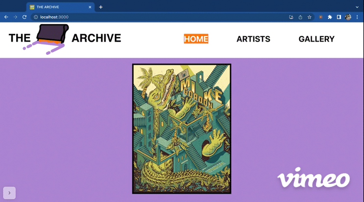

# THE ARCHIVE

Welcome to the frontend of THE ARCHIVE!

This React single-page application was designed in tandem with a [Ruby repository](https://github.com/ajdavid128/phase-3-sinatra-react-project) by [Leah Cardoz](https://github.com/lcardoz) and [Aaron David](https://github.com/ajdavid128) for their Phase 3 software engineering group project at Flatiron School (1 week to build).

## Project Details & Motivation:

THE ARCHIVE was born out of Aaron & Leah's mutual love for screenprinted artwork, and showcases screenprint artists and their prints, where users can submit their favorite artists and artwork. 

The focus of this project is building a Sinatra API backend that uses Active Record to access and persist data in a database, which will be used by a separate React frontend that interacts with the database via the API.

> All artwork and artist info are property of their rightful respective owner. Usage of artist and print images are for educational, non-commercial purposes only.

## Features:

Users are able to:
- View a timed slideshow of all of the prints on the Home page.
- See all artists on the Artists page and add a new artist by submitting a form.
- Click on an artist card on the Artists page to view their detail page and their associated prints.
- On an artist's detail page- add a new print by submitting a form, update an existing print's category tags, or delete an existing print.
- View a gallery of all print images with info about each print on the Gallery page.

## Demos:

[Watch Leah demo the entire app here!](https://vimeo.com/799986630)

**Home Page:**

**Artists Page / Artist Detail:**

**Add New Artist Feature:**

**Add New Print Feature:**

**Prints Gallery:**

